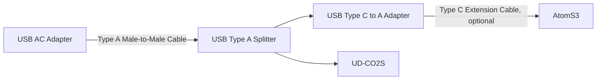

# atom-s3-co2
CO2 monitor integration for M5Stack AtomS3. Reads sensor values from [UD-CO2S](https://www.iodata.jp/product/tsushin/iot/ud-co2s/), and sends values to ThingsSpeak IoT platform. Temperature, Humidity (relative and absolute), CO2 concentration are shown in the display. Click on the display button to switch between each readings.

## Materials
- M5Stack AtomS3
- [UD-CO2S](https://www.iodata.jp/product/tsushin/iot/ud-co2s/)
- USB AC adapter (Type A)
- USB Type A male to male cable
- [USB Type A splitter](https://www.amazon.com/dp/B085BJRZN2)
    - One female end connects to power
    - One female end connects to UD-CO2S
    - Male end connects to Atom S3, using Type C to A adapter
- USB Type C to A adapter (used to connect AtomS3 to USB splitter)
- USB Type C extension cable (optional, for AtomS3 connection)

## Setup
- Prepare environment: VSCode + platform.io
- Setup `src/config.h`
    - ThingSpeak API keys, channel ID, data sending interval
    - Wi-Fi SSID and password
- Build and write the program to AtomS3 using USB
- Connect UD-CO2S to AtomS3
- Provide power 5V supply
- When AtomS3 is booted up, it will automatically connect to Wi-Fi and start reading values from the sensor.

## License
MIT license excluding files under `lib/EspUsbHost/`. See [here](https://github.com/mu373/tail-estimation/blob/master/LICENSE.md) for details.

## References
- This project was developed based on codes/libraries from [wakwak-koba/EspUsbHost](https://github.com/wakwak-koba/EspUsbHost).
